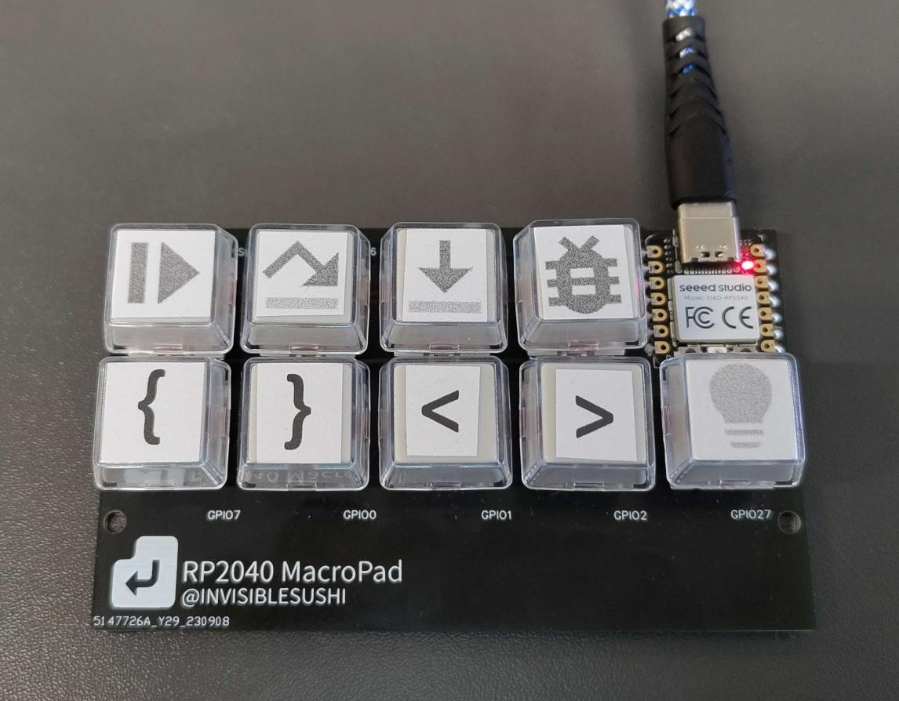
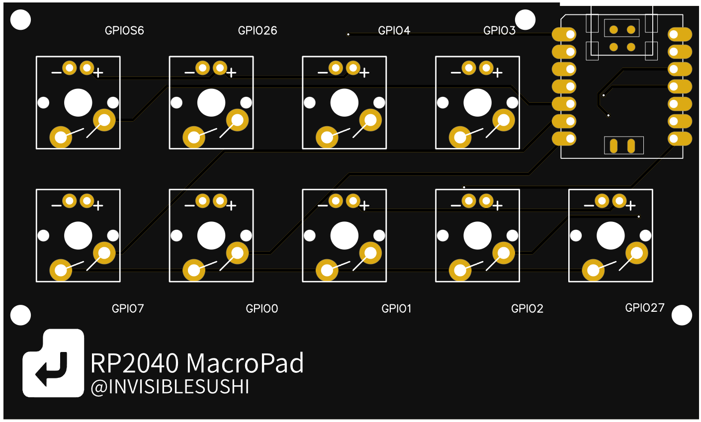

# RP2040-MacroPad
RP2040-MacroPad is a custom macrokeypad project based on the Seeed Xiao RP2040 microcontroller. 
It features Kailh mechanical switches and blank keycaps for customization. 

## Parts

1. **PCB**
2. **Mechanical switches**: Kailh Box red switches or any Cherry mx compatible
3. **Keycaps**: Transparent Keycaps Double-layer
4. **Seeed Studio XIAO RP2040**

## Installation

To get started with your RP2040-MacroPad, follow these steps:
1. **Install CircuitPython**
2. **Install Required Libraries**: `adafruit_hid` and `custom_keycodes`
3. **Upload the Code**: Upload the provided Python script (`code.py`) to RP2040.
4. **Customize keymapping in** `code.py`

## Xiao seeed RP2040 gpio mapping
| Button   | GPIO PIN | XIAO PIN | XIAO PIN | GPIO PIN | Button   |
|----------|----------|----------|----------|----------|----------|
| Button 7 | 26       | 0        | VCC      |          |          |
| Button 8 | 27       | 1        | GND      |          |          |
|          |          | 2        | 3v3      |          |          |
|          |          | 3        | 10       | 3        | Button 3 |
| Button 5 | 6        | 4        | 9        | 4        | Button 4 |
| Button 6 | 7        | 5        | 8        | 2        | Button 2 |
| Button 0 | 0        | 6        | 7        | 1        | Button 1 |
